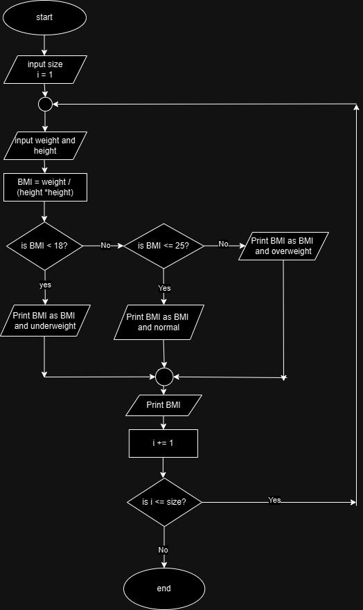

## Analysis  
  * input  
      1. size
      2. weight
      3. height
   * output  
     - BMI 
   * Operation 
        > BMI = weight / (height * height)
## pseudo code  
    step 1: start
    step 2: read input  
      - size
    step 3: initialize counter i to 1
    step 4: read input  
      - weight 
      - height
    step 5: calculate BMI
        - BMI = weight / (height * height)
    step 6: check if BMI is less than 18. if it is true, print BMI as BMI and underweight
    step 7: check if BMI is less than or equal to 25. if it is true, print BMI as BMI and normal
    step 8: check if BMI is greater than 25. if it is true print BMI as BMI and overweight.
    step 9: print BMI
    step 10: if counter i is less than or equal to size, then go to step 4. if not go to step 11.
    step 11: end  

  

## flow chart  
