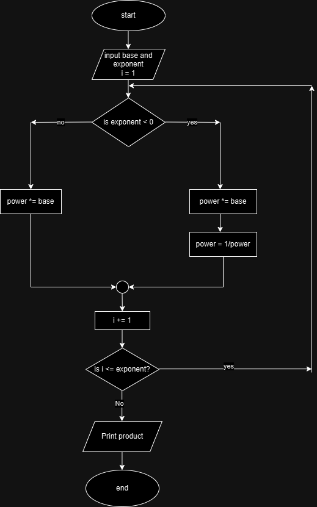

## Analysis  
* input  
    1. base
    2. exponent
* output  
    * power
* operation
  > power *= base  

## pseudo code  
    step 1: start
    step 2: read input  
      - base 
      - exponent
    step 3: initialize counter i to 1
    step 4: if exponent is less than 0, then power *= base. Then power = 1/power
    step 5: if expnent is greater than or equal to 0, then power *= base.  
    step 6: counter increases by 1. 
    step 7: if counter is less than or equal to the exponent, then go to step 4. If not go to step 8
    step 8: print power
    step 9: end  

## flow chart  

        